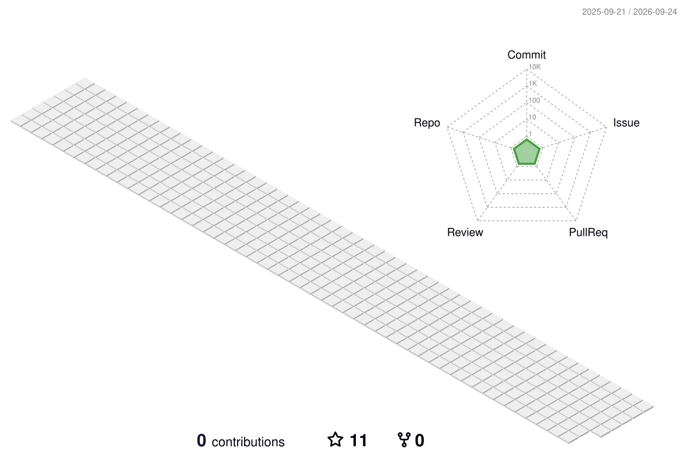

<!-- 动态打字效果 -->

  

      
  

  

      
  

  

      
  

<!-- 头像 -->

<!-- 个人介绍 -->
### 
✨我是 afishing，目标是成为一名优秀的全栈 & AI 应用工程师✨
  
   

🍭 酷爱编程，喜欢研究有趣的项目，信奉兴趣驱动式学习 🔭 
  
   

🌱 我目前正在深入学习 Spring Cloud 微服务与 LangChain Agent 应用开发 🌱
  
   

💻 熟练使用 Java / Python / C++ / QT，在后端开发与 AI 应用领域持续探索 💻
  
   

❓ 如有任何疑问和想法，欢迎在博客或者 Git 留言交流 ❓
  
   

<!-- 贪吃蛇动图（使用 gif 版本，确保动画播放） -->

  

   

<!-- 联系方式 -->
## Connect with me  

 &nbsp;&nbsp;&nbsp;

 &nbsp;&nbsp;&nbsp;

 &nbsp;&nbsp;&nbsp;

  

<!-- 奖杯墙 -->
## Github Score  

  

&nbsp;

<!-- 贡献曲线图 -->
## Github contribution
<table>
  <tr>
    <td>
      <picture>
        <source media="(prefers-color-scheme: dark)" srcset="https://github-readme-activity-graph.vercel.app/graph?username=afishing&theme=xcode&bg_color=FF000000&hide_border=true" />
        <source media="(prefers-color-scheme: light)" srcset="https://github-readme-activity-graph.vercel.app/graph?username=afishing&theme=xcode&bg_color=FF000000&color=000000&hide_border=true" />
        
      </picture>
  </tr>
</table>

&nbsp;

<!-- 3D个人贡献资料图（由 .github/workflows/profile-3d.yml 自动生成到 profile-3d-contrib/） -->

  <picture>
    <source media="(prefers-color-scheme: dark)" srcset="./profile-3d-contrib/profile-night-rainbow.svg" />
    <source media="(prefers-color-scheme: light)" srcset="./profile-3d-contrib/profile-green-animate.svg" />
    
  </picture>

&nbsp;

<!-- 技能表 -->
## My Skill Set  
<table><tr><td valign="top" width="33%">

<!-- 前端技能 -->
### Frontend  

  
  
  
  
  
  
  

</td><td valign="top" width="33%">

<!-- 后端技能 -->
### Backend  

  
  
  
  
  
  
  
  
  

</td><td valign="top" width="33%">

<!-- AI & 工具技能 -->
### AI & Tools  

  
  
  
  
  
  
  
  

</td></tr></table>

<!-- 访客计数 -->

  

